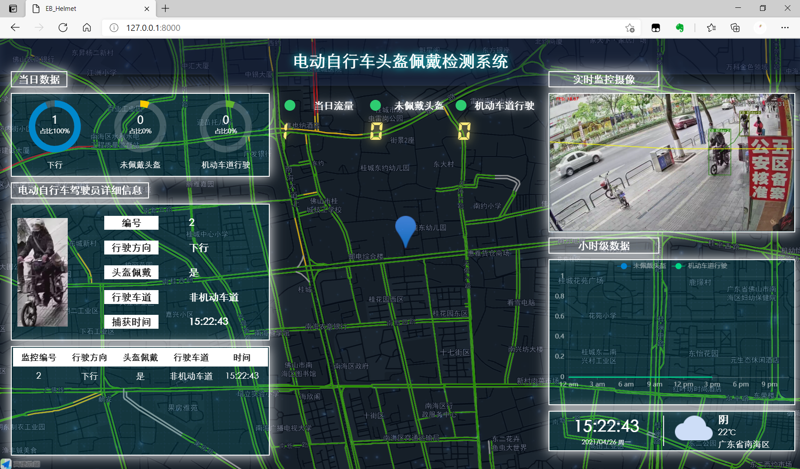

<center><font size = 10><b>基于深度学习的电动自行车头盔佩戴检测系统</b></font></center>
<center><font size = 8>——开发环境配置说明文档</font></center>

---

<center><font size = 5><b>目录</b></font></center>

[TOC]

---

# 1. 文档说明

本文档是毕业设计——基于深度学习的电动自行车头盔佩戴检测系统的开发环境配置说明文档，该文档包括运行环境说明以及基本环境配置两大部分。在程序运行前请认真查看此文档，并按照此文档说明对运行程序的设备环境进行对应配置。


# 2. 运行环境说明

## 2.1 硬件配置

设备硬件配置及其参数规格：

| 配置名称 | 参数规格 |
| :------: | :-----: |
| 中央处理器CPU | Intel(R) Core(TM) i5-7300HQ CPU @2.50GHz |
| 图形处理器GPU | GeForce GTX 1050Ti(4.0GB DDR5 768 CUDA) |
| 机带RAM | 16.0 GB (15.9 GB可用) DDR4 |

## 2.2 软件配置

程序运行所需软件及其版本信息：

| 软件名称 | 版本信息 |
| :------: | :-----: |
| 操作系统 | Windows10 64位操作系统，基于x64的处理器 |
| 集成开发环境 | Visual Studio Code v1.56.2 |
| Visual Studio Code插件 | Code Runner v0.11.4 |
| 数据库 | MySQL 5.7.33-log MySQL Community Server (GPL) |
| 编程语言 | Python 3.7.6 |
| CUDA版本 | cuda_11.1.0_456.43_win10 |
| cuDNN版本 | cudnn-11.1-windows-x64-v8.0.5.39 |
| 机器学习库 | Pytorch 1.7.1 |

## 2.3 程序依赖库

程序运行所依赖库及其版本信息（见程序主目录下requirements.txt文件）：

| 依赖库名称 | 版本信息 |
| :-------: | :------: |
| wandb | 0.10.28 |
| seaborn | 0.11.1 |
| torchvision | 0.8.2 |
| requests | 2.22.0 |
| opencv_python | 4.5.1.48 |
| torch | 1.7.1 |
| thop | 0.0.31.post2005241907 |
| matplotlib | 3.3.3 |
| Flask | 1.1.1 |
| Flask_SocketIO | 5.0.1 |
| PyMySQL | 1.0.2 |
| scipy | 1.4.1 |
| numpy | 1.19.3 |
| pandas | 1.0.1 |
| coremltools | 4.0 |
| tqdm | 4.42.1 |
| onnx | 1.8.1 |
| easydict | 1.9 |
| ipdb | 0.13.7 |
| motmetrics | 1.2.0 |
| pafy | 0.5.5 |
| Pillow | 8.2.0 |
| PyYAML | 5.4.1 |

# 3. 基本环境配置

请确保设备使用系统为Windows10 64位操作系统再进行以下操作。若为其他操作系统请自行下载软件对应版本。

## 3.1 软件安装

### 3.1.1 集成开发环境安装与配置

（1）程序所使用的集成开发环境为[Visual Studio Code](https://code.visualstudio.com/)，具体版本不作要求，下载最新版本即可。

（2）按如下操作安装Code Runner插件，具体版本不作要求，下载最新版本即可。


### 3.1.2 数据库安装与配置

（1）程序所使用的数据库为[MySQL](https://www.mysql.com/downloads/)，请下载v5.7版本非v8.0版本。

（2）配置root用户密码为123456

具体操作参考[链接](https://www.cnblogs.com/AmilyWilly/p/8334673.html)

### 3.1.3 编程语言安装

（1）程序所使用的编程语言为Python，下载并按照[Anaconda](https://www.anaconda.com/products/individual)，请下载64位Python v3.7版本。

### 3.1.4 CUDA和cuDNN安装与配置

（1）设备图形处理器GPU为GeForce GTX 1050Ti(4.0GB DDR5 768 CUDA)，请根据设备具体图形处理器GPU下载对应[CUDA](https://developer.nvidia.com/cuda-toolkit-archive)，请下载v11.1.0版本

（2）下载CUDA对应版本的[cuDNN](https://developer.nvidia.com/cudnn)，CUDA v11.1.0对应cuDNN版本为v8.0.5

（3）修改系统环境变量

具体安装过程参考[链接](https://blog.csdn.net/weixin_43735353/article/details/107412849)

（4）验证安装

通过执行以下命令验证安装是否成功

```cmd
nvcc -V
```

执行命令后得到以下信息即安装成功


### 3.1.5 机器学习库安装

（1）程序所使用的机器学习库为[Pytorch](https://pytorch.org/get-started/locally/)，请下载对应CUDA 11.1的版本。

（2）验证安装

通过执行以下命令验证安装是否成功

```cmd
python
```

```Python
import torch
print(torch.__version__)
print(torch.version.cuda)
print(torch.backends.cudnn.version())
```

执行命令后得到以下信息即安装成功


## 3.2 依赖库安装

通过执行以下命令对程序依赖库进行安装

```python
pip install -r requirements.txt
```

# 4. 运行程序

在运行程序前需要执行如下操作：

（1）利用MySQL导入程序主目录下database文件夹下的eb_helmet.sql数据库文件

（2）在webcam数据表下填入相应信息：

| 字段名 | 类型 | 含义 |
| :---: | :---: | :---: |
| device | varchar(10) | 监控视频设备名 |
| longitude | float(9,6) | 监控视频所处地理位置的经度 |
| latitude | float(9,6) | 监控视频所处地理位置的纬度 |
| source | varchar(100) | 监控视频RTSP地址 |

设置完成后执行程序主目录下的app.py即可运行程序，在浏览器中输入127.0.0.1:8000即可显示系统界面，系统界面如下图所示：



在D:/#Data/Detect/目录下可见到截取下来的电动自行车驾驶员JPG格式图片，若要修改图片存储路径或图片格式，修改程序主目录下的app.py第18、19行代码即可，如下图所示。


至此完成程序的所有环境配置和运行操作，祝学者一切顺利，若有疑问可联系邮箱johnhillross@163.com。
